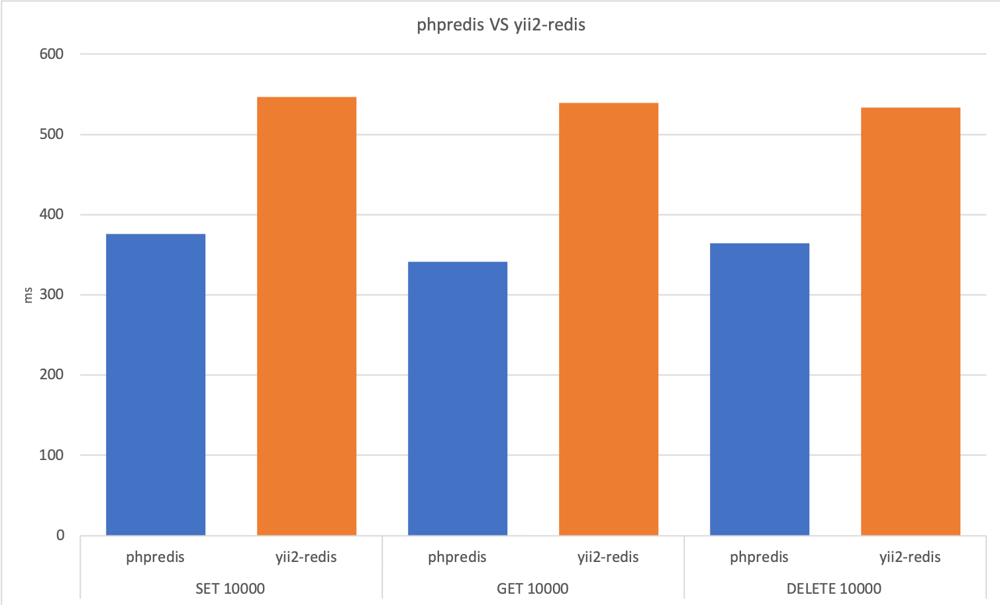

Redis Cache and Session for Yii2
======================
This extension provides the [redis](http://redis.io/) key-value store support for the [Yii framework 2.0](http://www.yiiframework.com).

It includes a `Cache` and `Session` storage handler in redis.

[](https://travis-ci.org/nuwber/yii2-phpredis)

**Notice: THIS REPO DOES NOT SUPPORT ACTIVE RECORD.**

Installation
------------

The preferred way to install this extension is through [composer](http://getcomposer.org/download/).

Either run

```bash
composer require --prefer-dist nuwber/yii2-phpredis
```

or add

```json
"nuwber/yii2-phpredis": "^2.0"
```

to the require section of your composer.json.


Configuration
-------------

To use this extension, you have to configure the Connection class in your application configuration:

```php
return [
    'components' => [
        'redis' => [
            'class' => \nuwber\yii2redis\Connection::class,
            'hostname' => 'localhost',
            'port' => 6379,
            'database' => 0,
        ],
        'cache' => [
            'class' => \nuwber\yii2redis\Cache::class,
        ],
        'session' => [
            'class' => \nuwber\yii2redis\Session::class,
        ],
    ],
];
```

Run unit test
-------------

You can specific your redis config

```bash
$ cp tests/config.php tests/config-local.php
```

and Run

```bash
$ ./vendor/bin/phpunit
```

Performance test
------------------

```
$ php tests/performance.php
```


